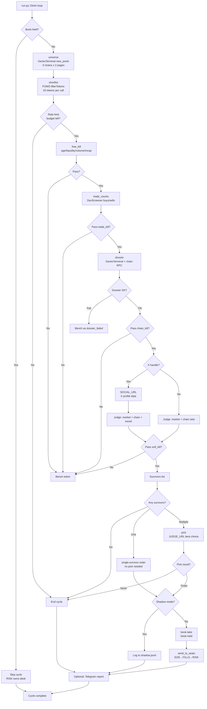

# Jev Desk

A memecoin launch desk built from @savipww's "Megabrain (Jev) & Six Grok Bots" setup guide
(x.com/savipww/status/2102720919185617314). Code fetches, Jev judges, code decides.

```
0. UNIVERSE  GeckoTerminal new_pools, 3 chains          -> fresh launches
1. LIST      FOMO filterTokens, 20 per call             -> hundreds, one batch
2. FREE CUT  age, liquidity, volume, mcap. No network   -> tens
3. TRADE CUT DexScreener buys and sells, one per token  -> a handful
4. DOSSIER   GeckoTerminal info + chain RPC + X         -> three per cycle
5. JUDGE     market + chain + social per token          -> scored shortlist
6. PICK      one choice over the shortlist              -> one token, or none
```

Then the order goes to the Grok Bot seats: SIZE -> FILLS -> RISK, with CHIEF logging.

## Read this first

This is the guide author's setup, not a strategy. Every threshold in `thresholds.py` is
theirs, tuned to their launches, bank and risk tolerance. The desk trades brand-new
memecoin launches, which is about as high-risk as trading gets, and the guide itself
carries a referral link and unverifiable performance claims. Run it in shadow mode for a
week, read the rows where you disagree, move the numbers, and only then consider
`--live`. Nothing here is financial advice.

## Project state

Shadow-first and unproven. The funnel runs end to end, but only against faked collectors
and a mock judge. Nothing in this repo has been validated against a live market.

What the 16 tests cover (`python -m pytest -q`, no network, no key):

- kill ordering and reason strings for all four filter stages
- wire shape of the `market`, `solana`, `bsc` and `robinhood` question sets
- `pick`: one option per candidate, both gates at their inclusive limit, declines below
  either gate, declines on an off-list choice, declines on no survivors, `NO_SOCIAL_CUT`
- a malformed question set raising instead of retrying
- book invariants: one position at a time, release, reasoned bench
- two full cycles: shadow never takes the book, and a held position skips the scan. The
  cycle fixture is mixed on purpose so each stage kills something, and the test asserts
  every token is accounted for exactly once across bench, the three named kill stages and
  the judge.
- `collect.normalise` and `collect.clean_handle`

What is not covered:

- **Every network path.** `universe`, `shortlist`, `trade_counts` and `dossier` are
  monkeypatched in the cycle tests. `fomo_api.py` — CDP, Privy extraction, refresh — has
  no coverage at all, and the FOMO `filterTokens` envelope is undocumented and unverified.
- **The real judge.** `judge.py` and `server.py` never run under test, so `DESK_SECRET`
  auth and `/book/release` are unproven. `mock_judge.py` stands in everywhere.
- **The `social` question set.** `FakeDesk.read_x` returns `None`, so the social branch in
  `run_once` is never entered and every test token carries the `NO_SOCIAL_CUT`.
- **Live mode.** Every cycle test passes `shadow=True` or exercises the held path, so the
  `book.take(order)` at the end of `run_once` is never reached.
- **Base.** `CHAIN_SET` routes net 8453 to the `bsc` set deliberately, but the fixtures are
  Solana only, so that routing is untested.
- **`desk.py` entirely** — bank, Telegram, seat handoff — and `run.py`'s flags.

A note on the `pick` tests: `mock_judge` is deterministic, and for the three-candidate
fixture its `worth_trading_at_all` lands at 0.584 against a `PICK_MIN_WORTH` of 0.60. Any
test that drives `pick` through the mock therefore only ever sees `None`. The gate tests
feed both gate values in through a stub instead, and read their limits from
`thresholds.py`, so retuning a threshold moves the tests with it.

CI runs the suite on every push and pull request across Python 3.10 through 3.14, so the
version floor above is checked rather than claimed. Dependencies are pinned, so a green
run a month from now means the same thing it means today.

Still outstanding: every number in `thresholds.py` is the guide author's rather than
yours.

## Files

| file | seat | what it does |
|---|---|---|
| `judge.py` | JUDGE | FastAPI service. Holds the only TypeSafe key. Answers typed questions, decides nothing. |
| `server.py` | JUDGE | `judge.py` plus `/book/held` and `/book/release` for RISK. Run this one with uvicorn. |
| `questions.py` | — | Every question the desk can ask. The one file you will reread. |
| `collect.py` | SCAN, VET | GeckoTerminal universe, FOMO shortlist, DexScreener trade counts, dossier, Solana RPC. |
| `fomo_api.py` | SCAN | FOMO client. Pulls the Privy bearer out of your logged-in Chrome over CDP. |
| `thresholds.py` | — | Every number. Retune here and nowhere else. |
| `filter.py` | — | The kills, in cost order: free -> trade -> chain -> soft. |
| `pick.py` | CHIEF | One Choice over the survivors plus the `worth_trading_at_all` gate. |
| `book.py` | — | SQLite: one open position, reasoned bench. RISK is the only caller of `release()`. |
| `main.py` | SHIFT | `run_once` and the 15-minute loop. `shadow=True` by default. |
| `desk.py` | — | The Grok Bot side seen from Python: bank, SOCIAL read, shadow log, Telegram, seat handoff. |
| `run.py` | — | Entrypoint. `--once`, `--live`, `--mock-judge`, `--bench`. |
| `judge_client.py` | bots | Six lines. The only place a bot touches the network for a judgement. |
| `mock_judge.py` | — | Keyless stand-in for Jev so the funnel can be tested. Never trade against it. |
| `prompts/` | bots | Paste-ready prompts: HANDOFF, SOCIAL, CHIEF, SIZE, FILLS, RISK. |
| `tests/` | — | `python -m pytest -q`: filter order, question wire shape, pick gating, book, a full faked cycle. |
| `requirements.in` | — | The five direct dependencies. Edit this one. |
| `requirements.txt` | — | Compiled lock, fully pinned. Install this one. Never hand-edit. |

## Setup

```bash
python3 -m venv .venv && source .venv/bin/activate      # python 3.10+
pip install -r requirements.txt
cp .env.example .env                                     # fill it in, then: set -a; source .env; set +a
python -m pytest -q                                      # should print "16 passed" — no keys needed
```

Always run tools as `python -m <tool>` rather than the bare executable. A bare `pytest`
can resolve to a pytest outside this venv — a pipx or Homebrew install in `~/.local/bin`
is the usual culprit, and zsh keeps the pre-`activate` path in its command hash table, so
activating the venv does not always dislodge it. That foreign interpreter has its own
site-packages and fails on the first project import:

```
ModuleNotFoundError: No module named 'typesafe_sdk'
```

The package is installed; the wrong Python is reading it. `python -m pytest` uses the
active interpreter by definition and cannot pick the wrong one. If you want the bare name
back, run `rehash` after `source .venv/bin/activate`, and confirm with
`python -c "import sys; print(sys.executable)"`.

### Dependencies

`requirements.txt` is a compiled lock: every package pinned, transitive ones included,
with markers so one file covers Python 3.10 through 3.14 on Linux and mac. Do not edit it
by hand. Add or move a dependency in `requirements.in`, then recompile:

```bash
uv pip compile requirements.in -o requirements.txt --universal --python-version 3.10
```

Compiling at 3.10 rather than your local version is the point: `pytest` needs `tomli` and
`exceptiongroup` below 3.11, and a lock frozen on a newer interpreter simply omits them.
CI recompiles and diffs, so a `requirements.in` edit without a recompile fails the build.

### 1. The judge (one machine, holds the key)

```bash
export TYPESAFE_API_KEY="ts-..."                         # console.typesafe.ai -> Keys
export DESK_SECRET="$(openssl rand -hex 24)"             # what the bots get. NOT the key.
uvicorn server:app --host 0.0.0.0 --port 8080
cloudflared tunnel --url http://localhost:8080           # bots run in xAI's cloud, not on your box
```

Prove the key works before anything else:

```bash
curl -X POST https://api.typesafe.ai/v1/systemone \
  -H "Authorization: Bearer $TYPESAFE_API_KEY" -H "Content-Type: application/json" \
  -d '{"state":"payouts have been failing for 3 days","model":"jev-latest",
       "questions":{"urgent":{"type":"noul","instructions":"This conveys urgency"}}}'
```

Then prove the link **from a bot's own terminal**, not your laptop:

```bash
curl -X POST $JUDGE_URL -H "Authorization: Bearer $DESK_SECRET" -H "Content-Type: application/json" \
  -d '{"question_set":"market","state":{"ticker":"TEST","age_minutes":42,"holder_count":310,
       "change":{"5m":0.04,"1h":0.22,"24h":0.61},"buys_h1":540,"sells_h1":120,
       "liquidity_usd":48000,"mcap_usd":310000,"volume_h24":610000,"intended_ticket_usd":900}}'
```

`answers.shape.choice` must be one of your options, probabilities must sum to ~1, and
`model` must be a version string, not an alias. If any of the three is off, stop there.

### 2. FOMO session

Launch the Chrome profile you use for FOMO with remote debugging and leave a
`fomo.family` tab open:

```bash
open -a "Google Chrome" --args --remote-debugging-port=9222      # mac
```

`fomo_api.Fomo.token()` reads the Privy token out of that tab's localStorage and
refreshes it before every cycle (it dies roughly hourly; that is normal). If you would
rather not expose CDP, paste the token into `FOMO_BEARER` instead; it will expire in an
hour and the desk will tell you.

The FOMO `filterTokens` response envelope is undocumented. `fomo_api._row` maps the field
names the guide lists (`marketCap, liquidity, volume24, holders, priceUSD, change5m..change24,
createdAt`) and tolerates a list or a dict envelope. If your first `--once` run logs
"malformed row" for every token, print one raw row and adjust `_row`; nothing downstream
needs to change.

### 3. The shift

```bash
export JUDGE_URL="https://<tunnel>/judge" DESK_SECRET="..." BANK_USD=1000
python run.py --once           # one cycle, shadow. Read the log and outbox/shadow.jsonl
python run.py                  # shadow, every 15 min. Leave it a week.
python run.py --bench          # what is sitting out and why
```

Shadow mode does everything except take the book and hand the order over. Each would-be
trade is one row in `outbox/shadow.jsonl` with the ticker, every answer with the model id,
and the rejection counters. Fill in `your_call` by hand and read only the rows where you
disagree. That is where your thresholds come from.

```bash
CONFIRM_LIVE=yes python run.py --live      # after the shadow week, not before
```

### 4. The Grok Bot seats

Paste `prompts/HANDOFF.txt` above the prompt of every seat that makes a judgement
(SCAN, VET, SOCIAL, CHIEF), then the seat's own file. SIZE, FILLS and RISK get no judge
call and no key. Record one judge call by hand in front of Grok Bot and save it as a
skill; skills are shared across every bot on the desk.

Two integration points on the Python side, both optional:

- `SOCIAL_URL`: an endpoint your SOCIAL bot serves. `POST {"x_handle": "..."}` returns
  the X block from `prompts/SOCIAL.txt`. Unset means no social read; the token carries
  the gap and `NO_SOCIAL_CUT` (0.60) shrinks the ticket.
- `SEATS_WEBHOOK_URL`: CHIEF's inbox. A finished order is POSTed there. Unset means it is
  written to `outbox/orders/` for you to hand over.

RISK frees the book with `POST $JUDGE_URL/../book/release` (same `DESK_SECRET`). Until
that call the desk does not scan, so a close nobody reported is a desk that stopped.

## Testing without a key

```bash
python -m pytest -q                              # no network, no key
DESK_SECRET=x JUDGE_MOCK=1 uvicorn server:app    # judge with synthetic answers
python run.py --once --mock-judge                # funnel end to end, still needs FOMO + GeckoTerminal
```

`python -m pytest`, not `pytest` — see Setup for why.

## Budget

GeckoTerminal allows 10 calls/min: six list fresh pools (3 chains x 2 pages), three are
left for dossiers per cycle. Want more dossiers, set `universe(pages=1)` and get six.
Jev is $0.042/Mtok in, output free: roughly ten calls of ~1,400 tokens per cycle, 96
cycles a day, about six cents a day.

## Failure handling

| what | do |
|---|---|
| 429 GeckoTerminal | back off a full minute, do not retry in place. Persisting: `pages=1`. |
| 429 DexScreener | lower `DEX_BUDGET` in `main.py`. |
| 429 / 529 Jev | the SDK retries with backoff on its own. |
| 422 Jev | your question is malformed. The cycle stops (`JudgeDown`). Never retry. |
| dossier throws | that token is benched as `dossier_failed`. Not a pass. |
| judge unreachable | the cycle stands down. No guessing. |
| FOMO 401/403 | bearer expired; refreshed from Chrome automatically. |

## Deviations from the guide

Everything the guide pastes is here as written, plus the glue it references but does not
include: `fomo_api.py`, `desk.py`, `run.py`, `server.py` (book endpoints for RISK),
`mock_judge.py` and tests. Small fixes to the guide's code: `chain_kill` treats Base like
BSC for the honeypot fact, `trade_counts` and `dossier` tolerate missing fields instead
of raising, a 422 from the judge stops the cycle instead of being swallowed, `--live`
needs `CONFIRM_LIVE=yes`, and the single-survivor path applies the same `size_factor`
cuts the pick path does.

## External connections

The desk connects to these external services:

**FOMO prod-api.fomo.family filterTokens** — required for shortlist stage
- Purpose: Fetches token metadata (mcap, liquidity, volume, holders, price changes) from FOMO's curated launches
- Connection: `FOMO_BEARER` environment variable OR Chrome CDP at `CDP_URL` (default 127.0.0.1:9222)
- Required for: Shadow mode and live trading
- Failure: Cycle stops. 401/403 triggers automatic refresh from Chrome

**Chrome CDP / Privy session** — required only if no FOMO_BEARER
- Purpose: Extracts live Privy bearer token from logged-in Chrome profile's localStorage
- Connection: `CDP_URL` (default 127.0.0.1:9222) to Chrome remote debugging port
- Required for: FOMO access when `FOMO_BEARER` is not set
- Failure: FOMO becomes unreachable
- Note: If using `scripts/launch-fomo-chrome.sh`, this script starts Chrome with the correct profile and debugging port

**GeckoTerminal api.geckoterminal.com** — required
- Purpose: Universe scan (new_pools) and detailed dossiers (token info, pool data, social handles)
- Connection: HTTPS, no auth, user-agent header
- Required for: Every cycle (universe) and per-token dossier
- Failure: 429 backs off one minute. Persistent 429 means reduce `pages=1` in universe call

**DexScreener api.dexscreener.com** — required for trade counts in shortlist stage
- Purpose: Provides buy/sell transaction counts for filtering
- Connection: HTTPS, no auth
- Required for: trade_kill stage
- Failure: 429 means lower `DEX_BUDGET` in main.py

**Solana mainnet RPC api.mainnet-beta.solana.com** — conditional
- Purpose: Fetches on-chain concentration data (top holder percentages) for Solana tokens
- Connection: HTTPS JSON-RPC, no auth
- Required for: Solana dossiers only (not BSC/Base/Robinhood)
- Failure: Dossier throws, token benched as `dossier_failed`

**TypeSafe judge via local uvicorn** — required
- Purpose: AI judgement calls for market/chain/social question sets
- Connection: `JUDGE_URL` with `Authorization: Bearer $DESK_SECRET`, backed by `TYPESAFE_API_KEY`
- Required for: Every token that passes free/trade/chain kills
- Failure: Unreachable judge stops the cycle. 422 (malformed question) stops cycle permanently

**Local judge/book FastAPI :8080** — required
- Purpose: Serves `/judge` for bots plus `/book/held` and `/book/release` for RISK seat
- Connection: Bots hit `JUDGE_URL` with `DESK_SECRET` bearer token
- Required for: All judgement calls and book coordination
- Failure: Judge unreachable stops cycle. Missing `/book/release` call freezes desk

**Cloudflare Tunnel** — optional, for remote seats
- Purpose: Exposes local :8080 judge/book server to xAI cloud where Grok Bots run
- Connection: `cloudflared tunnel --url http://localhost:8080`
- Required for: Remote Grok Bot seats (not needed if bots run on same machine)
- Failure: Bots cannot reach judge

**SOCIAL_URL** — optional X/Twitter seat
- Purpose: SOCIAL bot endpoint that scrapes X profile data for social question set
- Connection: `POST {"x_handle": "..."}` returns X block (followers, verified, age, bio)
- Required for: social question set (adds ~0.10 to ticket sizing when present)
- Failure: Unset or unreachable means `NO_SOCIAL_CUT` applied (0.60 size factor)

**SEATS_WEBHOOK_URL** — optional live seat handoff
- Purpose: CHIEF's inbox for finished orders
- Connection: POST order JSON to webhook
- Required for: Automated order handoff in `--live` mode
- Failure: Unset means orders written to `outbox/orders/` for manual handoff

**Telegram** — optional notifications
- Purpose: Per-cycle status report (trade or no-trade summary)
- Connection: `TELEGRAM_BOT_TOKEN` and `TELEGRAM_CHAT_ID`
- Required for: Operator notifications
- Failure: Silently skipped if not configured

Environment variable reference: `BANK_USD`, `DESK_SECRET`, `JUDGE_URL`, `TYPESAFE_API_KEY`, `FOMO_BEARER`, `CDP_URL`, `SOCIAL_URL`, `SEATS_WEBHOOK_URL`, `TELEGRAM_BOT_TOKEN`, `TELEGRAM_CHAT_ID`, `DESK_DB`, `JUDGE_MOCK`, `CONFIRM_LIVE`

## Activity workflow

### Cycle flowchart



### Cycle steps

1. **Check book status**: If RISK is holding a position, skip the entire scan. The desk does not trade while a position is open.

2. **Universe scan**: Query GeckoTerminal `new_pools` for fresh launches across Solana, BSC, and Robinhood chains. Two pages per chain = 6 GeckoTerminal slots.

3. **Shortlist fetch**: Call FOMO `filterTokens` (20 tokens per call) for metadata: mcap, liquidity, volume, holders, price changes (5m/1h/24h), created timestamp.

4. **Free kill stage**: Filter by age, liquidity, volume, mcap. No network calls. Surviving tokens cost one DexScreener slot each.

5. **Trade kill stage**: Fetch buy/sell counts from DexScreener. Check trade activity thresholds. Budget: `DEX_BUDGET` calls per cycle (default 25).

6. **Dossier stage**: Pull full token info from GeckoTerminal plus on-chain concentration from Solana RPC (if Solana). Budget: 3 GeckoTerminal slots. Failed dossiers bench the token as `dossier_failed`.

7. **Chain kill stage**: Apply chain-specific filters (honeypot facts, concentration limits, graduated status).

8. **Social lookup** (optional): If token has X handle and `SOCIAL_URL` is set, fetch X profile data. Missing social data applies `NO_SOCIAL_CUT` (0.60 size factor).

9. **Judge stage**: POST question sets (market + chain, optionally social) to `JUDGE_URL`. TypeSafe backend scores each token. Budget: ~10 calls/cycle at $0.042/Mtok.

10. **Soft kill stage**: Filter on judge answers (momentum, risk flags, social health).

11. **Pick stage**: If multiple survivors, call judge with `pick` question set to choose best option. Single survivor skips pick. No survivors ends cycle.

12. **Shadow or live**: Shadow mode logs order to `outbox/shadow.jsonl`. Live mode calls `book.take()` (desk now held) and sends order to seats via `SEATS_WEBHOOK_URL` or writes to `outbox/orders/`.

13. **Report**: Send summary to Telegram (optional) and wait 15 minutes for next cycle.

### Always-on sidecars

These processes must run continuously:

- **uvicorn server:app** on port 8080 — serves `/judge`, `/book/held`, `/book/release`
- **Chrome with remote debugging** on port 9222 — if using CDP for FOMO bearer refresh (not needed if `FOMO_BEARER` is set). Launch with `scripts/launch-fomo-chrome.sh` if present.
- **cloudflared tunnel** (optional) — only if seats run remotely and need to reach local judge
- **run.py** — the desk itself. Writes PID to `outbox/run.pid` when daemonized.
