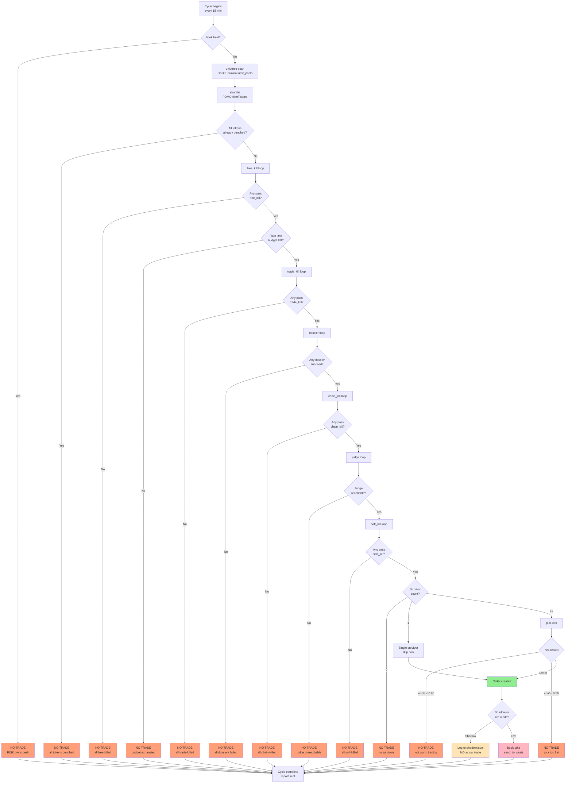
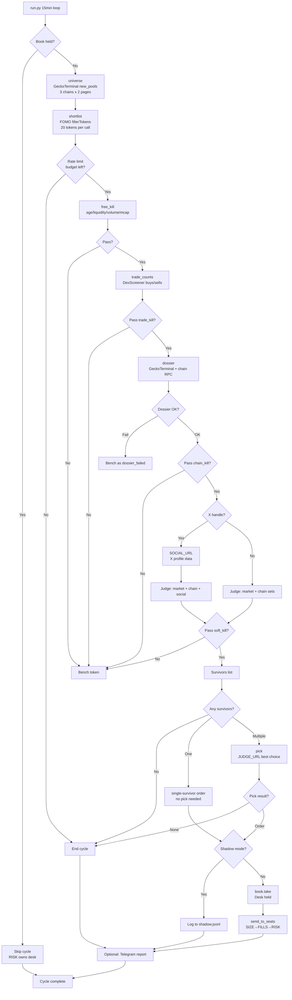

# Jev Desk

A memecoin launch desk built from @savipww's "Megabrain (Jev) & Six Grok Bots" setup guide
(x.com/savipww/status/2102720919185617314). Code fetches, Jev judges, code decides.

```
0. UNIVERSE  GeckoTerminal new_pools, 3 chains          -> fresh launches
1. LIST      FOMO filterTokens, 20 per call             -> hundreds, one batch
2. FREE CUT  age, liquidity, volume, mcap. No network   -> tens
3. TRADE CUT DexScreener buys and sells, one per token  -> a handful
4. DOSSIER   GeckoTerminal info + chain RPC + X         -> three per cycle
5. JUDGE     market + chain + social per token          -> scored shortlist
6. PICK      one choice over the shortlist              -> one token, or none
```

Then the order goes to the Grok Bot seats: SIZE -> FILLS -> RISK, with CHIEF logging.

## Read this first

This is the guide author's setup, not a strategy. Every threshold in `thresholds.py` is
theirs, tuned to their launches, bank and risk tolerance. The desk trades brand-new
memecoin launches, which is about as high-risk as trading gets, and the guide itself
carries a referral link and unverifiable performance claims. Run it in shadow mode for a
week, read the rows where you disagree, move the numbers, and only then consider
`--live`. Nothing here is financial advice.

## Project state

Shadow-first and unproven. The funnel runs end to end, but only against faked collectors
and a mock judge. Nothing in this repo has been validated against a live market.

What the 16 tests cover (`python -m pytest -q`, no network, no key):

- kill ordering and reason strings for all four filter stages
- wire shape of the `market`, `solana`, `bsc` and `robinhood` question sets
- `pick`: one option per candidate, both gates at their inclusive limit, declines below
  either gate, declines on an off-list choice, declines on no survivors, `NO_SOCIAL_CUT`
- a malformed question set raising instead of retrying
- book invariants: one position at a time, release, reasoned bench
- two full cycles: shadow never takes the book, and a held position skips the scan. The
  cycle fixture is mixed on purpose so each stage kills something, and the test asserts
  every token is accounted for exactly once across bench, the three named kill stages and
  the judge.
- `collect.normalise` and `collect.clean_handle`

What is not covered:

- **Every network path.** `universe`, `shortlist`, `trade_counts` and `dossier` are
  monkeypatched in the cycle tests. `fomo_api.py` — CDP, Privy extraction, refresh — has
  no coverage at all, and the FOMO `filterTokens` envelope is undocumented and unverified.
- **The real judge.** `judge.py` and `server.py` never run under test, so `DESK_SECRET`
  auth and `/book/release` are unproven. `mock_judge.py` stands in everywhere.
- **The `social` question set.** `FakeDesk.read_x` returns `None`, so the social branch in
  `run_once` is never entered and every test token carries the `NO_SOCIAL_CUT`.
- **Live mode.** Every cycle test passes `shadow=True` or exercises the held path, so the
  `book.take(order)` at the end of `run_once` is never reached.
- **Base.** `CHAIN_SET` routes net 8453 to the `bsc` set deliberately, but the fixtures are
  Solana only, so that routing is untested.
- **`desk.py` entirely** — bank, Telegram, seat handoff — and `run.py`'s flags.

A note on the `pick` tests: `mock_judge` is deterministic, and for the three-candidate
fixture its `worth_trading_at_all` lands at 0.584 against a `PICK_MIN_WORTH` of 0.60. Any
test that drives `pick` through the mock therefore only ever sees `None`. The gate tests
feed both gate values in through a stub instead, and read their limits from
`thresholds.py`, so retuning a threshold moves the tests with it.

CI runs the suite on every push and pull request across Python 3.10 through 3.14, so the
version floor above is checked rather than claimed. Dependencies are pinned, so a green
run a month from now means the same thing it means today.

Still outstanding: every number in `thresholds.py` is the guide author's rather than
yours.

## Files

| file | seat | what it does |
|---|---|---|
| `judge.py` | JUDGE | FastAPI service. Holds the only TypeSafe key. Answers typed questions, decides nothing. |
| `server.py` | JUDGE | `judge.py` plus `/book/held` and `/book/release` for RISK. Run this one with uvicorn. |
| `questions.py` | — | Every question the desk can ask. The one file you will reread. |
| `collect.py` | SCAN, VET | GeckoTerminal universe, FOMO shortlist, DexScreener trade counts, dossier, Solana RPC. |
| `fomo_api.py` | SCAN | FOMO client. Pulls the Privy bearer out of your logged-in Chrome over CDP. |
| `thresholds.py` | — | Every number. Retune here and nowhere else. |
| `filter.py` | — | The kills, in cost order: free -> trade -> chain -> soft. |
| `pick.py` | CHIEF | One Choice over the survivors plus the `worth_trading_at_all` gate. |
| `book.py` | — | SQLite: one open position, reasoned bench. RISK is the only caller of `release()`. |
| `main.py` | SHIFT | `run_once` and the 15-minute loop. `shadow=True` by default. |
| `desk.py` | — | The Grok Bot side seen from Python: bank, SOCIAL read, shadow log, Telegram, seat handoff. |
| `run.py` | — | Entrypoint. `--once`, `--live`, `--mock-judge`, `--bench`. |
| `judge_client.py` | bots | Six lines. The only place a bot touches the network for a judgement. |
| `mock_judge.py` | — | Keyless stand-in for Jev so the funnel can be tested. Never trade against it. |
| `prompts/` | bots | Paste-ready prompts: HANDOFF, SOCIAL, CHIEF, SIZE, FILLS, RISK. |
| `tests/` | — | `python -m pytest -q`: filter order, question wire shape, pick gating, book, a full faked cycle. |
| `requirements.in` | — | The five direct dependencies. Edit this one. |
| `requirements.txt` | — | Compiled lock, fully pinned. Install this one. Never hand-edit. |

## Setup

```bash
python3 -m venv .venv && source .venv/bin/activate      # python 3.10+
pip install -r requirements.txt
cp .env.example .env                                     # fill it in, then: set -a; source .env; set +a
python -m pytest -q                                      # should print "16 passed" — no keys needed
```

Always run tools as `python -m <tool>` rather than the bare executable. A bare `pytest`
can resolve to a pytest outside this venv — a pipx or Homebrew install in `~/.local/bin`
is the usual culprit, and zsh keeps the pre-`activate` path in its command hash table, so
activating the venv does not always dislodge it. That foreign interpreter has its own
site-packages and fails on the first project import:

```
ModuleNotFoundError: No module named 'typesafe_sdk'
```

The package is installed; the wrong Python is reading it. `python -m pytest` uses the
active interpreter by definition and cannot pick the wrong one. If you want the bare name
back, run `rehash` after `source .venv/bin/activate`, and confirm with
`python -c "import sys; print(sys.executable)"`.

### Dependencies

`requirements.txt` is a compiled lock: every package pinned, transitive ones included,
with markers so one file covers Python 3.10 through 3.14 on Linux and mac. Do not edit it
by hand. Add or move a dependency in `requirements.in`, then recompile:

```bash
uv pip compile requirements.in -o requirements.txt --universal --python-version 3.10
```

Compiling at 3.10 rather than your local version is the point: `pytest` needs `tomli` and
`exceptiongroup` below 3.11, and a lock frozen on a newer interpreter simply omits them.
CI recompiles and diffs, so a `requirements.in` edit without a recompile fails the build.

### 1. The judge (one machine, holds the key)

```bash
export TYPESAFE_API_KEY="ts-..."                         # console.typesafe.ai -> Keys
export DESK_SECRET="$(openssl rand -hex 24)"             # what the bots get. NOT the key.
uvicorn server:app --host 0.0.0.0 --port 8080
cloudflared tunnel --url http://localhost:8080           # bots run in xAI's cloud, not on your box
```

Prove the key works before anything else:

```bash
curl -X POST https://api.typesafe.ai/v1/systemone \
  -H "Authorization: Bearer $TYPESAFE_API_KEY" -H "Content-Type: application/json" \
  -d '{"state":"payouts have been failing for 3 days","model":"jev-latest",
       "questions":{"urgent":{"type":"noul","instructions":"This conveys urgency"}}}'
```

Then prove the link **from a bot's own terminal**, not your laptop:

```bash
curl -X POST $JUDGE_URL -H "Authorization: Bearer $DESK_SECRET" -H "Content-Type: application/json" \
  -d '{"question_set":"market","state":{"ticker":"TEST","age_minutes":42,"holder_count":310,
       "change":{"5m":0.04,"1h":0.22,"24h":0.61},"buys_h1":540,"sells_h1":120,
       "liquidity_usd":48000,"mcap_usd":310000,"volume_h24":610000,"intended_ticket_usd":900}}'
```

`answers.shape.choice` must be one of your options, probabilities must sum to ~1, and
`model` must be a version string, not an alias. If any of the three is off, stop there.

### 2. FOMO session

Launch the Chrome profile you use for FOMO with remote debugging and leave a
`fomo.family` tab open:

```bash
open -a "Google Chrome" --args --remote-debugging-port=9222      # mac
```

`fomo_api.Fomo.token()` reads the Privy token out of that tab's localStorage and
refreshes it before every cycle (it dies roughly hourly; that is normal). If you would
rather not expose CDP, paste the token into `FOMO_BEARER` instead; it will expire in an
hour and the desk will tell you.

The FOMO `filterTokens` response envelope is undocumented. `fomo_api._row` maps the field
names the guide lists (`marketCap, liquidity, volume24, holders, priceUSD, change5m..change24,
createdAt`) and tolerates a list or a dict envelope. If your first `--once` run logs
"malformed row" for every token, print one raw row and adjust `_row`; nothing downstream
needs to change.

### 3. The shift

```bash
export JUDGE_URL="https://<tunnel>/judge" DESK_SECRET="..." BANK_USD=1000
python run.py --once           # one cycle, shadow. Read the log and outbox/shadow.jsonl
python run.py                  # shadow, every 15 min. Leave it a week.
python run.py --bench          # what is sitting out and why
```

Shadow mode does everything except take the book and hand the order over. Each would-be
trade is one row in `outbox/shadow.jsonl` with the ticker, every answer with the model id,
and the rejection counters. Fill in `your_call` by hand and read only the rows where you
disagree. That is where your thresholds come from.

```bash
CONFIRM_LIVE=yes python run.py --live      # after the shadow week, not before
```

### 4. The Grok Bot seats

Paste `prompts/HANDOFF.txt` above the prompt of every seat that makes a judgement
(SCAN, VET, SOCIAL, CHIEF), then the seat's own file. SIZE, FILLS and RISK get no judge
call and no key. Record one judge call by hand in front of Grok Bot and save it as a
skill; skills are shared across every bot on the desk.

Two integration points on the Python side, both optional:

- `SOCIAL_URL`: an endpoint your SOCIAL bot serves. `POST {"x_handle": "..."}` returns
  the X block from `prompts/SOCIAL.txt`. Unset means no social read; the token carries
  the gap and `NO_SOCIAL_CUT` (0.60) shrinks the ticket.
- `SEATS_WEBHOOK_URL`: CHIEF's inbox. A finished order is POSTed there. Unset means it is
  written to `outbox/orders/` for you to hand over.

RISK frees the book with `POST $JUDGE_URL/../book/release` (same `DESK_SECRET`). Until
that call the desk does not scan, so a close nobody reported is a desk that stopped.

## Testing without a key

```bash
python -m pytest -q                              # no network, no key
DESK_SECRET=x JUDGE_MOCK=1 uvicorn server:app    # judge with synthetic answers
python run.py --once --mock-judge                # funnel end to end, still needs FOMO + GeckoTerminal
```

`python -m pytest`, not `pytest` — see Setup for why.

## Budget

GeckoTerminal allows 10 calls/min: six list fresh pools (3 chains x 2 pages), three are
left for dossiers per cycle. Want more dossiers, set `universe(pages=1)` and get six.
Jev is $0.042/Mtok in, output free: roughly ten calls of ~1,400 tokens per cycle, 96
cycles a day, about six cents a day.

## Failure handling

| what | do |
|---|---|
| 429 GeckoTerminal | back off a full minute, do not retry in place. Persisting: `pages=1`. |
| 429 DexScreener | lower `DEX_BUDGET` in `main.py`. |
| 429 / 529 Jev | the SDK retries with backoff on its own. |
| 422 Jev | your question is malformed. The cycle stops (`JudgeDown`). Never retry. |
| dossier throws | that token is benched as `dossier_failed`. Not a pass. |
| judge unreachable | the cycle stands down. No guessing. |
| FOMO 401/403 | bearer expired; refreshed from Chrome automatically. |

## Deviations from the guide

Everything the guide pastes is here as written, plus the glue it references but does not
include: `fomo_api.py`, `desk.py`, `run.py`, `server.py` (book endpoints for RISK),
`mock_judge.py` and tests. Small fixes to the guide's code: `chain_kill` treats Base like
BSC for the honeypot fact, `trade_counts` and `dossier` tolerate missing fields instead
of raising, a 422 from the judge stops the cycle instead of being swallowed, `--live`
needs `CONFIRM_LIVE=yes`, and the single-survivor path applies the same `size_factor`
cuts the pick path does.

## External connections

The desk connects to these external services:

**FOMO prod-api.fomo.family filterTokens** — required for shortlist stage
- Purpose: Fetches token metadata (mcap, liquidity, volume, holders, price changes) from FOMO's curated launches
- Connection: `FOMO_BEARER` environment variable OR Chrome CDP at `CDP_URL` (default 127.0.0.1:9222)
- Required for: Shadow mode and live trading
- Failure: Cycle stops. 401/403 triggers automatic refresh from Chrome

**Chrome CDP / Privy session** — required only if no FOMO_BEARER
- Purpose: Extracts live Privy bearer token from logged-in Chrome profile's localStorage
- Connection: `CDP_URL` (default 127.0.0.1:9222) to Chrome remote debugging port
- Required for: FOMO access when `FOMO_BEARER` is not set
- Failure: FOMO becomes unreachable
- Note: If using `scripts/launch-fomo-chrome.sh`, this script starts Chrome with the correct profile and debugging port

**GeckoTerminal api.geckoterminal.com** — required
- Purpose: Universe scan (new_pools) and detailed dossiers (token info, pool data, social handles)
- Connection: HTTPS, no auth, user-agent header
- Required for: Every cycle (universe) and per-token dossier
- Failure: 429 backs off one minute. Persistent 429 means reduce `pages=1` in universe call

**DexScreener api.dexscreener.com** — required for trade counts in shortlist stage
- Purpose: Provides buy/sell transaction counts for filtering
- Connection: HTTPS, no auth
- Required for: trade_kill stage
- Failure: 429 means lower `DEX_BUDGET` in main.py

**Solana mainnet RPC api.mainnet-beta.solana.com** — conditional
- Purpose: Fetches on-chain concentration data (top holder percentages) for Solana tokens
- Connection: HTTPS JSON-RPC, no auth
- Required for: Solana dossiers only (not BSC/Base/Robinhood)
- Failure: Dossier throws, token benched as `dossier_failed`

**TypeSafe judge via local uvicorn** — required
- Purpose: AI judgement calls for market/chain/social question sets
- Connection: `JUDGE_URL` with `Authorization: Bearer $DESK_SECRET`, backed by `TYPESAFE_API_KEY`
- Required for: Every token that passes free/trade/chain kills
- Failure: Unreachable judge stops the cycle. 422 (malformed question) stops cycle permanently

**Local judge/book FastAPI :8080** — required
- Purpose: Serves `/judge` for bots plus `/book/held` and `/book/release` for RISK seat
- Connection: Bots hit `JUDGE_URL` with `DESK_SECRET` bearer token
- Required for: All judgement calls and book coordination
- Failure: Judge unreachable stops cycle. Missing `/book/release` call freezes desk

**Cloudflare Tunnel** — optional, for remote seats
- Purpose: Exposes local :8080 judge/book server to xAI cloud where Grok Bots run
- Connection: `cloudflared tunnel --url http://localhost:8080`
- Required for: Remote Grok Bot seats (not needed if bots run on same machine)
- Failure: Bots cannot reach judge

**SOCIAL_URL** — optional X/Twitter seat
- Purpose: SOCIAL bot endpoint that scrapes X profile data for social question set
- Connection: `POST {"x_handle": "..."}` returns X block (followers, verified, age, bio)
- Required for: social question set (adds ~0.10 to ticket sizing when present)
- Failure: Unset or unreachable means `NO_SOCIAL_CUT` applied (0.60 size factor)

**SEATS_WEBHOOK_URL** — optional live seat handoff
- Purpose: CHIEF's inbox for finished orders
- Connection: POST order JSON to webhook
- Required for: Automated order handoff in `--live` mode
- Failure: Unset means orders written to `outbox/orders/` for manual handoff

**Telegram** — optional notifications
- Purpose: Per-cycle status report (trade or no-trade summary)
- Connection: `TELEGRAM_BOT_TOKEN` and `TELEGRAM_CHAT_ID`
- Required for: Operator notifications
- Failure: Silently skipped if not configured

Environment variable reference: `BANK_USD`, `DESK_SECRET`, `JUDGE_URL`, `TYPESAFE_API_KEY`, `FOMO_BEARER`, `CDP_URL`, `SOCIAL_URL`, `SEATS_WEBHOOK_URL`, `TELEGRAM_BOT_TOKEN`, `TELEGRAM_CHAT_ID`, `DESK_DB`, `JUDGE_MOCK`, `CONFIRM_LIVE`

## Ops panel

A minimal ops panel provides visibility into the running desk with real cycle data only.

**Start the judge and open the panel:**

```bash
python run.py              # start the shift (or leave it running)
```

Then visit `http://localhost:8080/ops` in your browser.

**What it shows:**
- Last cycle outcome (NO TRADE / SHADOW / ORDER / HOLDING)
- Seen / benched / judged counts
- Kill histograms by stage (free/trade/chain/soft) with reason counts
- Held positions from the book
- Per-token stage/reason rows (real data only, no demo tokens)

**Data source:** The desk writes `outbox/state.json` at the end of each cycle. The panel fetches `/api/state` every 20 seconds.

**Empty states:** If you see "No state.json yet", wait for a cycle to complete. The panel never invents demo tokens.

## Trade Decision Logic

### When the desk trades vs when it doesn't

The desk produces **one of two outcomes every cycle**: a trade (shadow or live) or `NO TRADE`. Understanding the path to both is the point.

**TRADE happens when:**
1. Book is **not** held (no open position)
2. At least one token survives all four kill stages (free → trade → chain → soft)
3. For multiple survivors: `pick()` returns an order (passes `worth_trading_at_all >= 0.60` and `confidence >= 0.55`)
4. For a single survivor: order is created immediately (no pick needed)
5. **Shadow mode**: order logged to `outbox/shadow.jsonl` (NO actual trade, just recorded)
6. **Live mode** (`--live` + `CONFIRM_LIVE=yes`): `book.take()` called, order sent to seats

**NO TRADE happens when any of these is true:**
- **Book held**: RISK owns the desk, entire scan skipped until `/book/release` called
- **Rate limit exhausted**: DexScreener or GeckoTerminal budget depleted mid-cycle
- **All tokens benched**: every token in universe already judged recently and still sitting out
- **All killed at free stage**: age/liquidity/volume/mcap filters eliminate everything (no network cost)
- **All killed at trade stage**: trade count thresholds eliminate all survivors from free stage
- **All dossiers failed**: GeckoTerminal/RPC calls throw for all survivors
- **All killed at chain stage**: honeypot/authority/concentration facts bench remaining tokens
- **All killed at soft stage**: judge answers fail thresholds (momentum spent, concentration risk, etc.)
- **No survivors**: zero tokens make it through all four kills
- **Pick returns None**: multiple survivors exist but either:
  - `worth_trading_at_all` < 0.60 (today is not a day)
  - `confidence` < 0.55 (pick is too flat across options)
- **Judge unreachable** (`JudgeDown` exception): cycle stands down entirely, no guessing

The log line `NO TRADE. seen X, benched Y, judged Z, killed {...}` tells you exactly which gate stopped the flow.

### Decision tree: TRADE or NO TRADE



### Kill stages reference

The desk applies **four kill stages in strict cost order**: free → trade → chain → soft. Each stage benches tokens for different durations (see `book.py` `BENCH_MINUTES`).

#### 1. free_kill (no network cost, runs on hundreds)

Source: `filter.py:free_kill()`, data from FOMO `filterTokens` batch.

| Check | Threshold | Bench duration | Meaning |
|---|---|---|---|
| `age` | 15 min ≤ age ≤ 72 hours | 20 min | Too young = noisy data; too old = not a launch |
| `liquidity` | ≥ $12,000 | 25 min | Insufficient liquidity to support entry/exit |
| `volume` | ≥ $40,000 (24h) | 25 min | Low volume = illiquid, hard to fill |
| `mcap` | $60k ≤ mcap ≤ $8M | 25 min | Too small = rug risk; too large = limited upside |

**Purpose**: Eliminate obvious mismatches before spending DexScreener slots. Arithmetic only, no network calls.

#### 2. trade_kill (one DexScreener call per token, runs on tens)

Source: `filter.py:trade_kill()`, data from DexScreener `/tokens/<addr>`.

| Check | Threshold | Bench duration | Meaning |
|---|---|---|---|
| `no_pair` | pair must exist | (default 45 min) | DexScreener has no data for this token |
| `trades` | ≥ 150 trades (24h) | 25 min | Inactive token, no market interest |
| `no_sells` | Must have sells if >20 buys (1h) | (default 45 min) | One-way market, potential honeypot |

**Purpose**: Validate trade activity. Costs one DexScreener slot per token that passed `free_kill`.

**Rate limit**: `DEX_BUDGET = 25` calls per cycle. Once exhausted, remaining tokens are skipped (not benched).

#### 3. chain_kill (after dossier, still free — facts not judgements)

Source: `filter.py:chain_kill()`, data from GeckoTerminal dossier + Solana RPC.

| Check | Threshold | Chain | Bench duration | Meaning |
|---|---|---|---|---|
| `top_wallet` | ≤ 5% | Solana only | 100,000 min (~69 days) | Single wallet owns too much, exit risk |
| `top_10` | ≤ 60% | where data exists | 100,000 min | Top 10 wallets too concentrated |
| `holders` | ≥ 80 | where data exists | 90 min | Too few holders, centralized float |
| `authority_open` | must be closed | Solana only | 100,000 min | Mint/freeze authority still enabled = rug vector |
| `honeypot` | must be false | BSC, Base | 100,000 min | Honeypot fact from GeckoTerminal |

**Purpose**: Apply chain-specific facts. These are not judgements — they're facts from on-chain data or GT metadata. Facts bench longest (100k min = permanent rejection for this token's lifetime).

**Rate limit**: `GT_DOSSIER = 3` slots per cycle. GeckoTerminal allows 10 calls/min; 6 are spent on universe scan, leaving 3 for dossiers.

#### 4. soft_kill (judge answers against thresholds, runs on a handful)

Source: `filter.py:soft_kill()`, data from TypeSafe judge responses (market + chain + social question sets).

| Check | Direction | Threshold | Bench duration | Meaning |
|---|---|---|---|---|
| `concentration_is_exit_risk` | max | 0.55 | 90 min | Holder concentration creates exit risk |
| `momentum_already_spent` | max | 0.60 | 25 min | Price momentum exhausted, late entry |
| `liquidity_fits_ticket` | min | 0.60 | 25 min | Liquidity too thin for intended ticket size |
| `account_is_the_project` | min | 0.70 | 360 min (6 hr) | X account not legitimate/official |
| `recycled_account` | max | 0.50 | 360 min | X account is recycled/bought |
| `audience_is_real` | min | 0.45 | (default 45 min) | Followers are bots/fake |
| `effort` | min | 1.0 | (default 45 min) | Low-effort social presence |
| `dev_still_loaded` | max | 0.55 | 90 min | Developer wallet still heavily loaded |
| `sellable_by_evidence` | min | 0.60 | (default 45 min) | Robinhood only: evidence of sellability |
| `shape` (choice) | — | Must not be "fading" or "one_buyer" | 25 min | Chart shape shows fading interest or single buyer |
| `shape` (probability) | — | `crowd` probability ≥ 0.55 | 25 min | Even if choice is "crowd", confidence too low |
| `sell_side_risk` (choice) | — | Must not be "flagged" or "suspicious" | 100,000 min | Chain-level sell-side risk detected |

**Purpose**: Filter on AI judgement calls. These are probabilistic assessments from the TypeSafe model, not facts. Bench durations vary: social checks bench longest (360 min), momentum checks shortest (25 min).

**Rate limit**: ~10 judge calls per cycle at $0.042/Mtok = ~$0.06/day.

### The pick gate

If multiple tokens survive all four kills, `pick()` decides which one to trade. **Pick can still return `None`** (NO TRADE) even with survivors:

**Two pick gates (both must pass):**
1. `worth_trading_at_all` ≥ 0.60 — "Is today a day to trade at all?" A blanket noul across all candidates.
2. `confidence` ≥ 0.55 — "Is the pick confident enough?" A flat distribution means no clear favorite.

**Pick bypass**: If exactly **one survivor** exists, pick is skipped. The order is created immediately with `model: "single-survivor"` and no confidence score.

**Size factors** (applied to both pick and single-survivor orders):
- `DARK_TICKET_CUT = 0.40` when `data_coverage == "dark"` (Robinhood low-visibility tokens)
- `NO_SOCIAL_CUT = 0.60` when no usable X account exists

These multiply: a Robinhood dark token with no social = 0.40 × 0.60 = 0.24× final ticket size.

## Activity workflow

### Cycle flowchart



### Component interaction sequence

```mermaid
sequenceDiagram
    participant R as run.py
    participant M as main.py
    participant B as book.py
    participant C as collect.py
    participant F as filter.py
    participant J as judge (TypeSafe)
    participant P as pick.py
    participant D as desk.py
    
    R->>M: main(fomo, judge, desk, shadow=True)
    loop Every 15 minutes
        M->>B: held()?
        alt Book held
            B-->>M: {ticker, minutes}
            M->>D: report(None, stats)
            Note over M: NO TRADE - RISK owns desk
        else Book free
            M->>C: universe() [3 chains × 2 pages]
            C-->>M: ['<addr>:<netId>', ...]
            M->>C: shortlist(fomo, ids) [FOMO filterTokens, 20/call]
            C-->>M: [{tid, ticker, mcap, liquidity, ...}, ...]
            
            loop Each token in shortlist
                M->>B: benched(tid)?
                alt Already benched
                    B-->>M: True
                    Note over M: Skip (still serving time)
                else Not benched
                    M->>F: free_kill(token)
                    alt Killed
                        F-->>M: reason (age|liquidity|volume|mcap)
                        M->>B: sit(tid, reason)
                    else Pass free_kill
                        M->>C: trade_counts(token) [DexScreener]
                        C-->>M: {buys_h1, sells_h1, trades_h24, ...}
                        M->>F: trade_kill(token)
                        alt Killed
                            F-->>M: reason (no_pair|trades|no_sells)
                            M->>B: sit(tid, reason)
                        else Pass trade_kill
                            M->>C: dossier(token) [GT info + Solana RPC]
                            alt Dossier fails
                                C-->>M: Exception
                                M->>B: sit(tid, "dossier_failed")
                            else Dossier OK
                                C-->>M: {holder_count, top_10_percent, x_handle, ...}
                                M->>F: chain_kill(dossier)
                                alt Killed
                                    F-->>M: reason (honeypot|authority_open|concentration)
                                    M->>B: sit(tid, reason)
                                else Pass chain_kill
                                    alt X handle exists & SOCIAL_URL set
                                        M->>D: read_x(handle)
                                        D-->>M: {followers, verified, ...} or None
                                    end
                                    M->>J: judge("market", dossier)
                                    J-->>M: {answers: {shape, momentum, ...}, model}
                                    M->>J: judge("solana"|"bsc"|"robinhood", dossier)
                                    J-->>M: {answers: {concentration, authority, ...}}
                                    alt Social data exists
                                        M->>J: judge("social", social_state)
                                        J-->>M: {answers: {account_is_project, effort, ...}}
                                    end
                                    M->>F: soft_kill(answers)
                                    alt Killed
                                        F-->>M: reason (momentum_spent|concentration|social)
                                        M->>B: sit(tid, reason)
                                    else Pass soft_kill
                                        Note over M: Token survives → survivors list
                                    end
                                end
                            end
                        end
                    end
                end
            end
            
            alt No survivors
                M->>D: report(None, stats)
                Note over M: NO TRADE - all killed
            else One survivor
                Note over M: Create order (single-survivor, no pick)
                alt Shadow mode
                    M->>D: log_shadow(order, stats)
                else Live mode
                    M->>B: take(order)
                    M->>D: send_to_seats(order)
                end
                M->>D: report(order, stats)
            else Multiple survivors
                M->>P: pick(judge, survivors)
                P->>J: judge("pick", state)
                J-->>P: {answers: {best, worth_trading_at_all}}
                alt Pick returns None
                    P-->>M: None
                    M->>D: report(None, stats)
                    Note over M: NO TRADE - not worth/conf too low
                else Pick returns order
                    P-->>M: order
                    alt Shadow mode
                        M->>D: log_shadow(order, stats)
                    else Live mode
                        M->>B: take(order)
                        M->>D: send_to_seats(order)
                    end
                    M->>D: report(order, stats)
                end
            end
        end
    end
```



### Cycle steps (detailed)

1. **Check book status** (`book.held()`)
   - Query: `SELECT ticker, opened_at FROM position WHERE id=1`
   - If row exists: RISK owns the desk, return `{ticker, minutes}`
   - If no row: desk is free, proceed with scan
   - **NO TRADE path**: Book held → skip entire cycle until RISK calls `/book/release`

2. **Universe scan** (`collect.universe()`)
   - Endpoint: `GET api.geckoterminal.com/api/v2/networks/{net}/new_pools?page={p}`
   - Chains: Solana (1399811149), BSC (56), Robinhood (4663) — Base (8453) shares BSC question set
   - Pages: 2 per chain = **6 GeckoTerminal slots** (60% of free tier's 10/min budget)
   - Output: `['<addr>:<netId>', ...]` list of fresh pool tokens
   - **Rate limit**: 429 stops pagination for that network, preserves IDs from other nets/pages

3. **Shortlist fetch** (`collect.shortlist()`)
   - Endpoint: `POST prod-api.fomo.family/filterTokens` (20 token IDs per call)
   - Data: mcap, liquidity, volume (24h), holders, price, change (5m/1h/4h/24h), created timestamp
   - Sorting: By turnover (`volume_h24 / mcap_usd`) descending → prioritizes active tokens for limited budget
   - **Rate limit**: FOMO bearer expires ~hourly, refreshed automatically from Chrome CDP or `FOMO_BEARER` env var

4. **Bench check** (`book.benched()`)
   - Query: `SELECT until FROM bench WHERE tid=?`
   - If `until > now()`: token still serving time, skip to next
   - **Stats**: `benched` counter increments (included in NO TRADE report)

5. **Free kill stage** (`filter.free_kill()`)
   - Source: Data from FOMO batch (no additional network calls)
   - Checks: age (15 min – 72 hr), liquidity (≥$12k), volume (≥$40k/24h), mcap ($60k – $8M)
   - **NO TRADE path**: All tokens killed → bench each with reason, cycle ends with `free {age: X, liquidity: Y, ...}` in stats
   - **Bench**: `sit(tid, reason)` with duration from `BENCH_MINUTES` (20–25 min for free kills)

6. **Budget check**
   - Counters: `dex_slots` (default 25), `gt_slots` (default 3)
   - **NO TRADE path**: Budget exhausted → remaining tokens skipped (not benched), cycle ends

7. **Trade kill stage** (`filter.trade_kill()`)
   - Endpoint: `GET api.dexscreener.com/latest/dex/tokens/{addr}` **(one call per token)**
   - Data: buys/sells per window (1h, 6h, 24h), trades_h24
   - Checks: pair exists, ≥150 trades/24h, has sells if >20 buys/1h
   - **NO TRADE path**: All survivors killed → cycle ends with `trade {no_pair: X, trades: Y, ...}` in stats
   - **Rate limit**: 429 → lower `DEX_BUDGET` in `main.py` (current default 25)
   - **Budget**: Decrements `dex_slots` per call

8. **Dossier stage** (`collect.dossier()`)
   - Endpoint: `GET api.geckoterminal.com/api/v2/networks/{net}/tokens/{addr}/info` **(one call per token)**
   - Data: holder count/distribution, top 10%, developer holding %, GT score details, honeypot flag, mint/freeze authority (Solana), description, X handle
   - Solana only: `POST api.mainnet-beta.solana.com` → `getTokenSupply` + `getTokenLargestAccounts` for exact top wallet %
   - **NO TRADE path**: All dossiers throw → tokens benched as `dossier_failed`, cycle ends
   - **Rate limit**: GT 429 → back off 1 min, persistent 429 → set `pages=1` in universe call
   - **Budget**: Decrements `gt_slots` per call (success or failure)

9. **Chain kill stage** (`filter.chain_kill()`)
   - Source: Facts from dossier (no additional network calls)
   - Checks: top wallet ≤5% (Solana), top 10 ≤60%, holders ≥80, authority closed (Solana), not honeypot (BSC/Base)
   - **NO TRADE path**: All survivors killed → bench each for 90–100k min (facts bench longest), cycle ends with `chain {honeypot: X, authority_open: Y, ...}` in stats

10. **Social lookup** (optional, `desk.read_x()`)
    - Condition: `x_handle` exists in dossier AND `SOCIAL_URL` env var set
    - Endpoint: `POST $SOCIAL_URL` with `{"x_handle": "..."}`
    - Data: followers, verified, account age, bio (collected by SOCIAL bot's X plugin)
    - **Failure handling**: HTTP error or timeout → returns `None`, no bench (token not at fault)
    - **Missing social**: Applies `NO_SOCIAL_CUT = 0.60` size factor in pick/single-survivor order

11. **Judge stage** (`judge_client.judge()`)
    - Endpoint: `POST $JUDGE_URL/judge` with `Authorization: Bearer $DESK_SECRET`
    - Question sets (per token):
      - `market`: shape, momentum_already_spent, liquidity_fits_ticket (always)
      - `solana` / `bsc` / `robinhood`: chain-specific concentration, authority, honeypot, data coverage (always)
      - `social`: account_is_the_project, effort, recycled_account, audience_is_real (only if `x_account` exists)
    - Backend: TypeSafe API (`TYPESAFE_API_KEY`) with model `jev-latest`
    - Response: `{answers: {question_name: {noul|score|choice, probabilities, confidence}}, model: "jev-X.Y.Z"}`
    - **NO TRADE path**: Judge unreachable → `JudgeDown` exception, entire cycle stands down (no guessing)
    - **Malformed question**: 422 response → `JudgeDown` exception, cycle stops permanently (question is wrong and stays wrong)
    - **Rate limit**: SDK retries 429/529 with backoff automatically
    - **Budget**: ~10 calls/cycle × ~1,400 tokens × $0.042/Mtok = ~$0.06/day

12. **Soft kill stage** (`filter.soft_kill()`)
    - Source: Judge answers against `SOFT` thresholds in `thresholds.py`
    - Checks: concentration ≤0.55, momentum ≤0.60, liquidity fit ≥0.60, social health (if present), shape not "fading"/"one_buyer", shape crowd probability ≥0.55, sell_side_risk not "flagged"/"suspicious"
    - **NO TRADE path**: All survivors killed → cycle ends with `soft {momentum_already_spent: X, concentration_is_exit_risk: Y, ...}` in stats
    - **Bench**: 25 min (momentum/shape) to 360 min (social) depending on reason

13. **Survivors check**
    - Count survivors after all four kills
    - **NO TRADE path**: Zero survivors → cycle ends with `NO TRADE. seen X, judged Y, killed {...}`

14. **Pick stage** (`pick.pick()`)
    - **Bypass**: If exactly 1 survivor → create order immediately with `model: "single-survivor"`, no pick call
    - **Multiple survivors**: Call `judge("pick", state)` with candidate summaries
    - Question: `best` (choice over tickers) + `worth_trading_at_all` (noul, blanket assessment)
    - **NO TRADE paths**:
      - `worth_trading_at_all` < 0.60 → None (today is not a day)
      - `best` confidence < 0.55 → None (pick too flat)
      - `best` choice not in survivors list → None (schema violation, log and stand down)
    - **Size factors applied**:
      - `DARK_TICKET_CUT = 0.40` if `data_coverage == "dark"` (Robinhood)
      - `NO_SOCIAL_CUT = 0.60` if no usable X account
      - These multiply: dark + no social = 0.40 × 0.60 = 0.24× ticket

15. **Shadow or live mode**
    - **Shadow** (default): `desk.log_shadow(order, stats)` → append to `outbox/shadow.jsonl` with `your_call: None` field for manual review. **NO actual trade**, no `book.take()`, no seat handoff.
    - **Live** (`--live` + `CONFIRM_LIVE=yes`):
      1. `book.take(order)` → `INSERT OR REPLACE INTO position VALUES (1, ticker, addr, net, time.time())` — desk now held
      2. `desk.send_to_seats(order)` → POST to `SEATS_WEBHOOK_URL` or write to `outbox/orders/<order_id>.json`
      3. Seats: SIZE → FILLS → RISK (in that order, CHIEF coordinates)
      4. RISK calls `/book/release` when close is filled → `DELETE FROM position`, desk free again

16. **Report and sleep** (`desk.report()`)
    - Log line: `ORDER <id> <ticker> on <chain> size xN conf N model <model>` OR `NO TRADE. seen X, benched Y, judged Z, killed {...}`
    - Telegram: One line per cycle (optional, requires `TELEGRAM_BOT_TOKEN` + `TELEGRAM_CHAT_ID`)
    - Sleep: 15 minutes (`CYCLE_SECONDS = 900`) before next cycle

### Interpreting log output

Every cycle produces a summary line that tells you exactly what happened. Learn to read these at a glance.

#### TRADE logs (shadow or live)

```
SHADOW would trade TICKER (solana) size x0.60 conf 0.78
ORDER 2026-09-30T13:42:00Z TICKER on solana size x1.0 conf 0.82 model jev-3.1.4
```

**Fields:**
- `size xN`: Size factor applied to `BANK_USD * 0.06` (max SIZE can allow). Factors: `DARK_TICKET_CUT` (0.40), `NO_SOCIAL_CUT` (0.60), or 1.0 baseline
- `conf N`: Pick confidence (0.55 minimum). Only present for multi-survivor picks, not single-survivor orders
- `model`: Judge model version (`jev-X.Y.Z`) or `single-survivor` (no pick needed)

#### NO TRADE logs

```
NO TRADE. seen 247, benched 18, judged 12, killed {'free': {'age': 34, 'liquidity': 89, 'volume': 23}, 'trade': {'trades': 8, 'no_sells': 2}, 'chain': {'authority_open': 3}, 'soft': {'momentum_already_spent': 4, 'shape': 1}}
```

**Parse it:**
1. `seen 247`: Total tokens in FOMO shortlist this cycle
2. `benched 18`: Tokens skipped because still serving bench time from prior cycles
3. `judged 12`: Tokens that made it to the judge stage (passed free/trade/chain kills)
4. `killed {...}`: Breakdown by stage and reason
   - `free`: age/liquidity/volume/mcap (no network cost)
   - `trade`: no_pair/trades/no_sells (DexScreener cost)
   - `chain`: honeypot/authority_open/concentration (fact cost)
   - `soft`: momentum/concentration/social/shape (judge cost)

**Common patterns:**
- **Heavy free kills** (`free: {age: 200, ...}`): Universe is full of too-young or too-old launches. Normal; free filter doing its job.
- **No judged tokens** (`judged 0`): All tokens killed at free/trade/chain stages. Budget saved, but may indicate thresholds too tight.
- **Many judged, all soft-killed** (`judged 25, soft: {...}`): Tokens passed facts but failed judge thresholds. Review `SOFT` in `thresholds.py`.
- **Zero killed** (`killed {}`): All tokens were benched. Normal in slow markets; bench clears over time.

#### HOLDING logs

```
HOLDING TICKER for 23 min, no scan
```

**Meaning:** RISK seat has not yet called `/book/release` for the open position. Desk remains idle until release. If this persists >60 min, check:
1. RISK seat is running and received the order
2. Position was closed and RISK called `/book/release`
3. Release call succeeded (200 response from `$JUDGE_URL/../book/release`)

**Stuck desk recovery:**
```bash
# Manually release the book (only if you know the position is closed)
curl -X POST $JUDGE_URL/../book/release -H "Authorization: Bearer $DESK_SECRET"

# Or query what's held and why
python run.py --bench
```

#### Rate limit logs

```
WARNING:collect:GeckoTerminal 429 on solana page 2, stopping pagination for this network
WARNING:main.py:dossier failed TICKER: GeckoTerminal 429: over 10/min
```

**Actions:**
- **Universe 429**: Set `pages=1` in `main.py` `universe()` call → frees 3 GT slots for dossiers
- **Dossier 429**: Reduce dossier budget (currently `GT_DOSSIER = 3`) or wait for rate limit reset
- **DexScreener 429**: Lower `DEX_BUDGET` in `main.py` (default 25)

#### Judge failure logs

```
WARNING:main.py:judge failed TICKER: timeout
ERROR:main.py:malformed question set, stopping cycle: 422 Client Error
```

**Meanings:**
- **Timeout/unreachable**: Network issue, judge server down. Cycle stands down (`JudgeDown`), no guessing. Token not benched (not its fault).
- **422 malformed**: Question schema is wrong. Cycle stops permanently until code is fixed. Never retried.

### Always-on sidecars

These processes must run continuously:

- **uvicorn server:app** on port 8080 — serves `/judge`, `/book/held`, `/book/release`
- **Chrome with remote debugging** on port 9222 — if using CDP for FOMO bearer refresh (not needed if `FOMO_BEARER` is set). Launch with `scripts/launch-fomo-chrome.sh` if present.
- **cloudflared tunnel** (optional) — only if seats run remotely and need to reach local judge
- **run.py** — the desk itself. Writes PID to `outbox/run.pid` when daemonized.
